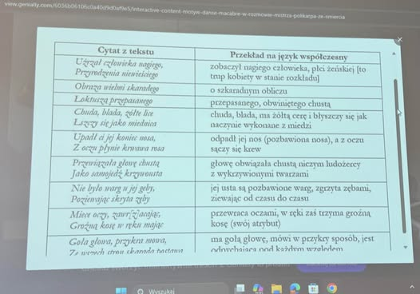
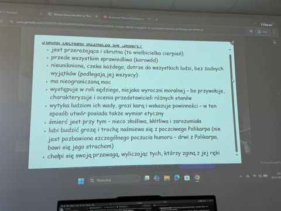

# Rozmowa Mistrza Polikarpa ze Śmiercią (Taniec Śmierci)

**Memento mori** – pamiętaj o śmierci

**Autor:** Nieznany (utwór anonimowy, powstały ok. XV wieku)

---

## Kontekst historyczny

"Rozmowa Mistrza Polikarpa ze Śmiercią" to jeden z najważniejszych polskich utworów średniowiecznych, zaliczany do tzw. literatury moralitetowej. Utwór wpisuje się w popularny w Europie motyw "danse macabre" (taniec śmierci), który miał przypominać ludziom o nieuchronności śmierci i równości wszystkich wobec niej – bez względu na stan, majątek czy wykształcenie.

---

## Przesłanie utworu

- Utwór ma charakter dydaktyczny – ostrzega przed pychą, przypomina o przemijaniu i konieczności przygotowania się na śmierć.
- Śmierć ukazana jest jako postać kobieca, budząca grozę, ale też sprawiedliwa – nie omija nikogo.
- Rozmowa Polikarpa ze Śmiercią to alegoria losu człowieka – każdy, niezależnie od pozycji społecznej, musi stanąć twarzą w twarz ze śmiercią.

---

## Przebieg utworu

- Polikarp, uczony mistrz, prosi Boga, by mógł ujrzeć Śmierć za życia.
- Jego prośba zostaje spełniona – Śmierć pojawia się i rozpoczyna z nim rozmowę.
- Śmierć opowiada o swojej roli, wymienia różne grupy społeczne, które zabiera: królów, duchownych, rycerzy, chłopów, bogatych i biednych.
- Utwór kończy się przestrogą i wezwaniem do życia w zgodzie z sumieniem.

---

## Kim jest Polikarp?

- **Człowiek wykształcony** – określany jako "mędrzec wielki" i "mistrz wybrany".
- **Uczony mistrz** – magister, absolwent uniwersytetu, symbolizuje ludzi nauki i rozumu.
- **Równy wobec śmierci** – mimo wiedzy i pozycji społecznej, Polikarp – jak każdy człowiek – boi się śmierci i nie może jej uniknąć.
- **Znaczenie imienia** – po grecku "Polikarp" oznacza "płodność", "obfitość" – w kontekście utworu odnosi się do bogactwa umysłu i wiedzy.

---

# CYTAT Z TEKSTU | PRZEKLAD NA JEZYK WSPOLCZESNY

---

# Jakimi cechami odznacza sie smierc?

---

## Kara od pani - Musze przeczytac

- Marian Turski, "Auschwitz nie spadło z nieba" – refleksja nad złem, przemijaniem i odpowiedzialnością człowieka.

---

## Najważniejsze motywy

- **Nieuchronność śmierci**
- **Równość wszystkich ludzi wobec śmierci**
- **Marność dóbr doczesnych**
- **Potrzeba życia zgodnie z sumieniem**
